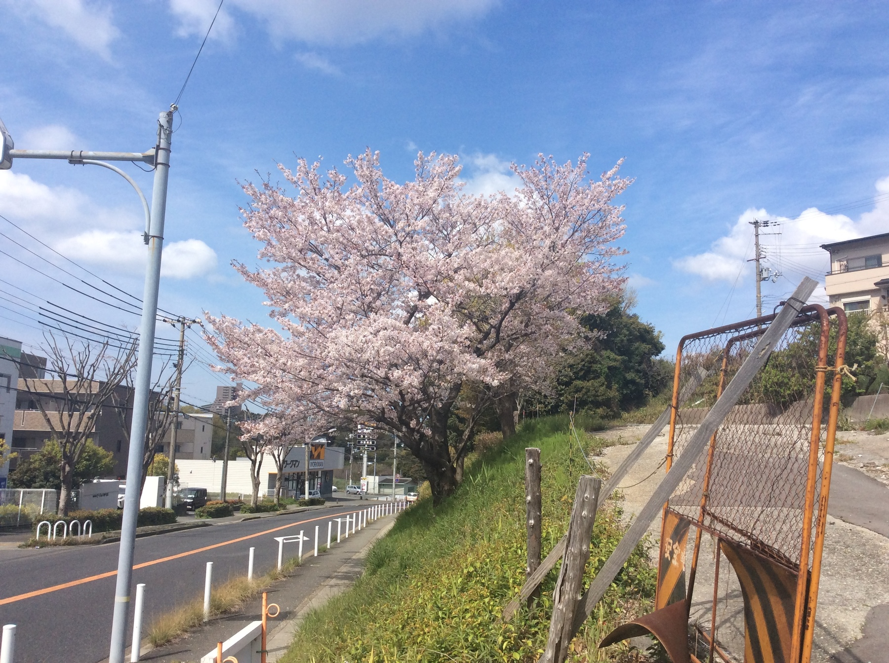

東北では４月中〜下旬頃が桜の見頃だという。

これは先々週の週末に撮った実家近くの桜の写真。

# 自分はやっぱり夢を持って生きようと思った

* 理想論なき現実論はただの反復である。
* 現実論なき理想論はただの迷惑だけど。
* 夢を現実にしようともがいているすがたこそが人生そのものだと思うから。  
  （間違っているかもしれないけど）

# 世間というものを知らないから

* 自分は、超がつくほどの世間知らずだったなと思う。
  * でも知らないものは知らない。
  * 本当に知らない。
  * カマトトぶってるわけじゃなくて。
* 学ぶ機会がなかった。
  * 幸か不幸か。
  * 世の中というものの現実を学ばずに済んできたんだな。
  * 過保護のカホコやな。
* 一般的にはどこで学ぶんだか。
  * ~~たぶん親だと思う。~~
  * 公務員の子は公務員になりたがる。
  * 公務員としてのこなしかたもよく弁えている。
* ~~揃いも揃ってあんな親。~~
* ~~子育ての共同事業体としてうちの両親は未熟すぎた。~~

# 今日の予定

* 昨日までの積み残しを処理する１日となりそう。
* はじけられるのは明日になりそう。それまで元気はとっておこう。
* 残り容量少ないマックに以下をインストール。
  * [Ubuntu Linux 20.04 LTS 淡々と記録しながらインストール](https://github.com/izudon/izudon.github.io/wiki/Ubuntu-20.04-LTS)
  * GIMP
  * Inkscape
* 『ゼロから作る Deep Learning』[まとめながら](https://github.com/izudon/izudon.github.io/wiki/ゼロから作る-Deep-Learning)勉強続き。
  * ラッキー！最終章は「読み物」だった。
  * 今日中に終わらせよう。

# 今朝の感謝３つ。

1. 日テレのドラマ面白い。放映当時は気づかなくてすみません。ありがとう。
2. 毎月お給料払ってくれてありがとう＞会社。
3. 岩井コスモ証券の担当者さん、振替依頼票を送ってくれてありがとう。

# memo

* 過保護のカホコ
* 同期のサクラ
* 凡人のための地域再生入門
* [橋下徹氏に夏目三久アナの直球質問「政治に未練？」](https://www.sponichi.co.jp/entertainment/news/2020/04/21/kiji/20200421s00041000211000c.html)
  * 以前バンキシャ！でも東国原元宮崎県知事にも同じような質問をしていた。
* [「緊急」の魔力、法を破ってきた歴史　憲法学者の警鐘](https://digital.asahi.com/articles/ASN4K3CQ3N4BUPQJ00C.html)
  * 学者らしい厳密な議論になっているのできっちりと読んでおきたいのだけれど。
